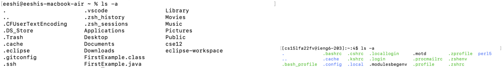

## Installing VS Code
* Go to the [VS Code](https://code.visualstudio.com/) website and find the download for your OS.
* Download VS Code and open the application. Your VS Code tab should look like the image below.

***
## Remotely Connecting
* Open a terminal in VS Code and enter the following command, replacing the 'zz' with your account ID.

`$ ssh cs15lfa22zz@ieng6.ucsd.edu`

* Type `yes` when the terminal asks if you want to continue connecting, and then type in your password. Your terminal tab should look like the image below.

***
## Trying Some Commands
* Try running different commands on your personal computer as well as on the remote computer.
* A few examples of commands to try are:
1. `cd ~`
2. `cd`
3. `ls -lat`
4. `ls -a`
5. `mkdir`
6. `cat`

* The image below shows the difference between the command `ls -a` run on my personal computer compared to the remote computer.

***
## Moving Files With `scp`
* To copy files from the client computer to the remote computer, we use a command called `scp`. On your personal computer, create a file called `WhereAmI.java` that has the following code:
***
## Setting an SSH Key

***
## Optimizing Remote Running
