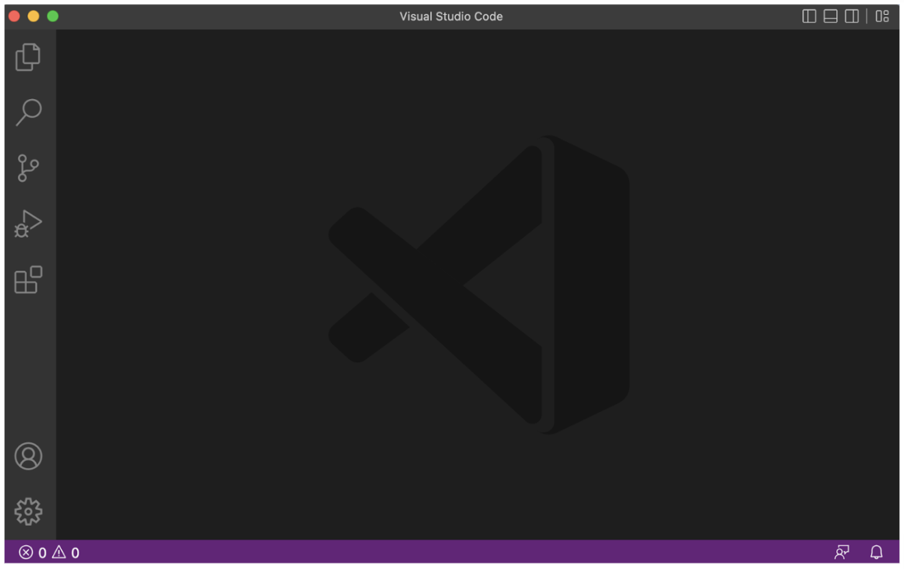
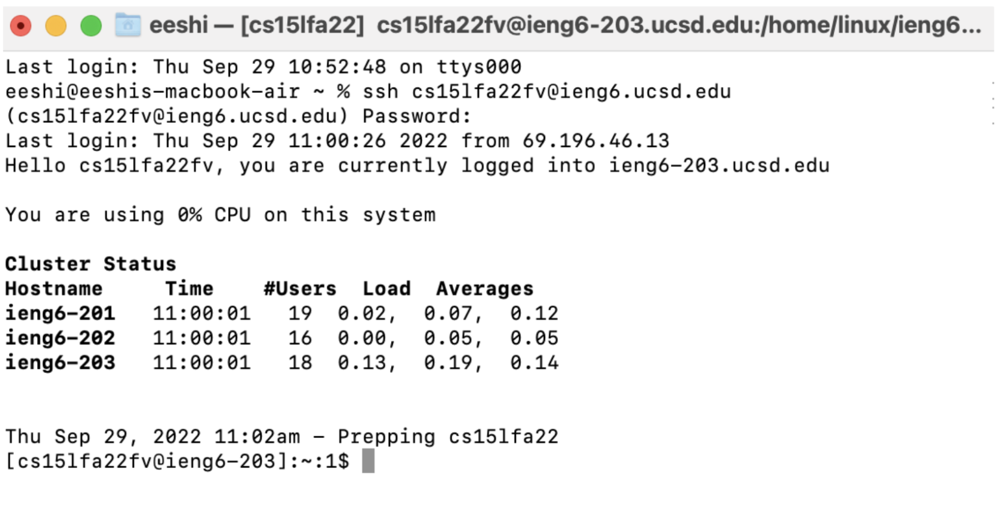
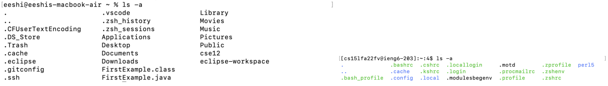
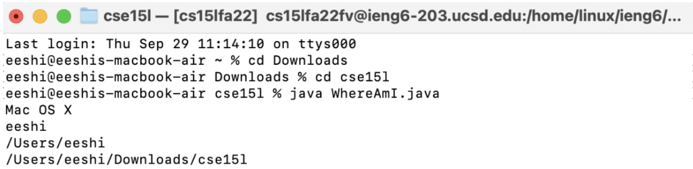
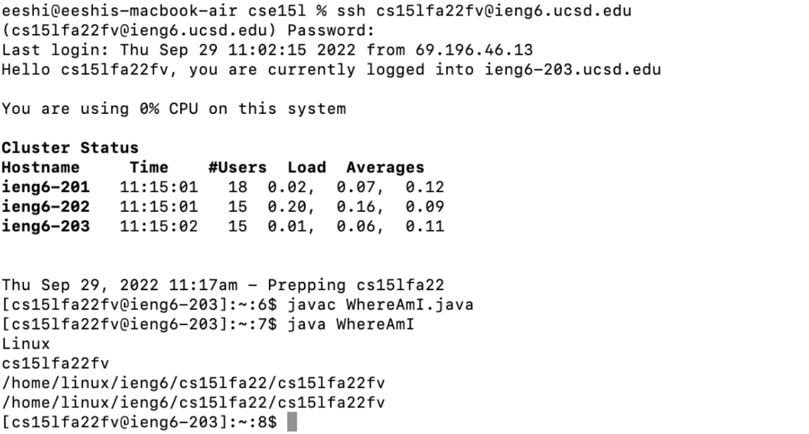
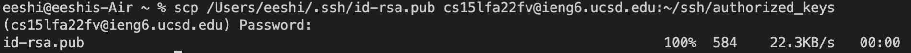

## Installing VS Code
* Go to the [VS Code](https://code.visualstudio.com/) website and find the download for your OS.
* Download VS Code and open the application. Your VS Code tab should look like the image below.


***
## Remotely Connecting
* Open a terminal in VS Code and enter the following command, replacing the 'zz' with your account ID.

`$ ssh cs15lfa22zz@ieng6.ucsd.edu`

* Type `yes` when the terminal asks if you want to continue connecting, and then type in your password. Your terminal tab should look like the image below.

***
## Trying Some Commands
* Try running different commands on your personal computer as well as on the remote computer.
* A few examples of commands to try are:
1. `cd ~`
2. `cd`
3. `ls -lat`
4. `ls -a`
5. `mkdir`
6. `cat`

* The image below shows the difference between the command `ls -a` run on my personal computer compared to the remote computer.

***
## Moving Files With `scp`
* To copy files from the client computer to the remote computer, we use a command called `scp`. On your personal computer, create a file called `WhereAmI.java` that has the following code:
```
class WhereAmI {
  public static void main(String[] args) {
    System.out.println(System.getProperty("os.name");
    System.out.println(System.getProperty("user.name");
    System.out.println(System.getProperty("user.home");
    System.out.println(System.getProperty("user.dir");
  }
}
```
* Compile and run the WhereAmI program on your personal computer using `javac` and `java` like in the image below.

* Copy the file into the remote computer using the code below, replacing the 'zz' with your account ID.

`scp WhereAmI.java cs15lfa22zz@ieng6.ucsd.edu:~/`

* Type your password, then log in to ieng6 using ssh. When you type the command `ls`, you should see the WhereAmI.java file in the directory.
* Compile and run the WhereAmI program on the remote computer using `javac` and `java`; the output should be similar to the one in the image below.

***
## Setting an SSH Key
* To make the SSH key, type the command `ssh-keygen` into the terminal. Press `enter` when you're asked to enter a file in which to save the key. You should get an output like the one in the image below.
[ssh-keygen output](keygenoutput.png)
* Log in to the remote computer (ieng6) and make a new directory using the command `mkdir .ssh`. Then, log out using `Ctrl-D`.
* Type the command below into your personal computer terminal, using your account ID and path. You should get an output in the terminal similar to the one in the image below.
`scp /{PATH}/id-rsa.pub cs15lfa22zz@ieng6.ucsd.edu:~/.ssh/authorized_keys`

***
## Optimizing Remote Running
*
