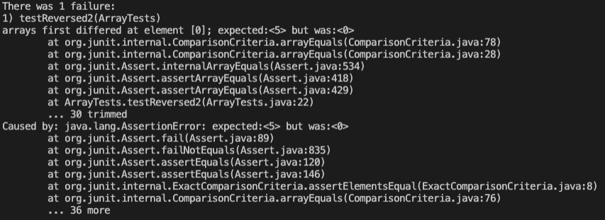
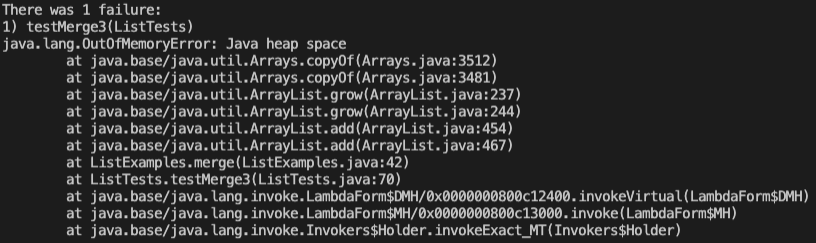

## Part 1
```

    import java.io.IOException;
    import java.net.URI;
    import java.util.ArrayList;

    class Handler implements URLHandler {
      ArrayList<String> strings = new ArrayList<String>();
  
      public String handleRequest(URI url) {
        String returnString = "";
    
        if(url.getPath().equals("/")) {
          for(int i = 0; i < strings.size(); i ++) {
            returnString += strings.get(i) + " ";
          }
      
         return returnString;
        }
  
        else if(url.getPath().equals("/search")) {
          String returnString2 = "";
          ArrayList<String> queryStrings = new ArrayList<String>();
          String[] querySearch = url.getQuery().split("=");
    
          if(querySearch[0].equals("s")) {
            String substring = querySearch[1];
      
            for(int i = 0; i < strings.size(); i ++) {
              if(strings.get(i).contains(substring)) {
                returnString2 += strings.get(i) + " ";
              }
            }
          }
    
          return returnString2;
        }
  
        else {
         System.out.println("Path: " + url.getPath());
    
          if(url.getPath().contains("/add")) {
            String[] querySearch = url.getQuery().split("=");
      
            if(querySearch[0].equals("s")) {
              String stringToAdd = querySearch[1];
              strings.add(stringToAdd);
              return "String added!";
            }
          }
    
          return "404 Not Found!";
        }
      }
    }

    class SearchEngine {
     public static void main(String[] args) {
        if(args.length == 0) {
          System.out.println("Missing port number! Try any number between 1024 and 49151");
          return;
        }
    
        int port = Integer.parseInt(args[0]);
        Server.start(port, new Handler());
      }
    }
                                          
```


For the image above, no method is called. There are no relevant arguments. The relevant fields are the words already added, since they are displayed if no method is specified. If these values change, the new set of words will be printed on the screen when the page is reloaded.


For the image above, the add method is called. The relevant argument is "add?". The relevant fields are "s=" and the word to be added (in this case, "hello"). If this value is changed, a different word will be added to the list when the page is reloaded, but the text on the screen will stay the same.


For the images above, the search method is called. The relevant argument is "search?". The relevant fields are "s=" and the word to be looked up (in these cases, "h" and "hey"). We can see that when these values are changed, different words are printed on the screen when the page is reloaded. Since none of the words in the list contained "hey," no words were printed with this search query, while two words were printed with the "h" search query.

## Part 2
Bug 1 (ArrayExamples reversed method)

Failure-inducing input:

```
    @Test
    public void testReversed() {
        int[] input = {1, 2, 3, 4, 5};
        assertArrayEquals(new int[]{5, 4, 3, 2, 1}, ArrayExamples.reversed(input));
    }
```

Symptom:



Bug:
```
    arr[i] = newArray[arr.length - i - 1];
    
    return arr;
```

Explanation:
In the test output, we can see that the test is failing because we expect a value of 5 as our first element, but we find 0 instead. This is because in the code, we are setting the element at index 0 of our first array equal to the new array's last element, instead of the other way around. Since the new int array does not have any of its elements set yet, they are all pre-set to 0. In order to fix this big, we should replace the code above with:
```
    newArray[i] = arr[arr.length - i - 1];
    
    return newArray;
```

***

Bug 2 (ListExamples merge method)

Failure-inducing input:

```
    @Test
    public void testMerge() {
        List<String> list1 = new ArrayList<>();
        list1.add("a");
        list1.add("c");
        list1.add("e");
        
        List<String> list2 = new ArrayList<>();
        list2.add("b");
        list2.add("d");
        list2.add("f");
        list2.add("g");
        list2.add("h");
        list2.add("i");
        list2.add("j"0;
        
        List<String> result = new ArrayList<>();
        result.add("a");
        result.add("b");
        result.add("c");
        result.add("d");
        result.add("e");
        result.add("f");
        result.add("g");
        result.add("h");
        result.add("i");
        result.add("j");
        
        assertArrayEquals(result.toArray(), ListExamples.merge(list1, list2).toArray());
    }
```

Symptom:


Bug:
```
    while(index2 < list2.size()) {
        result.add(list2.get(index2));
        index1 += 1;
    }
```

Explanation:
In this test case, list2 had larger remaining elements once list1 was sorted. This means the compiler would break out of the first while loop and enter the third while loop. However, we see that in this while loop, we are incrementing the wrong variable. In order to fix the bug, we should replace the code above with:
```
    while(index2 < list2.size()) {
        result.add(list2.get(index2));
        index2 += 1;
    }
```
