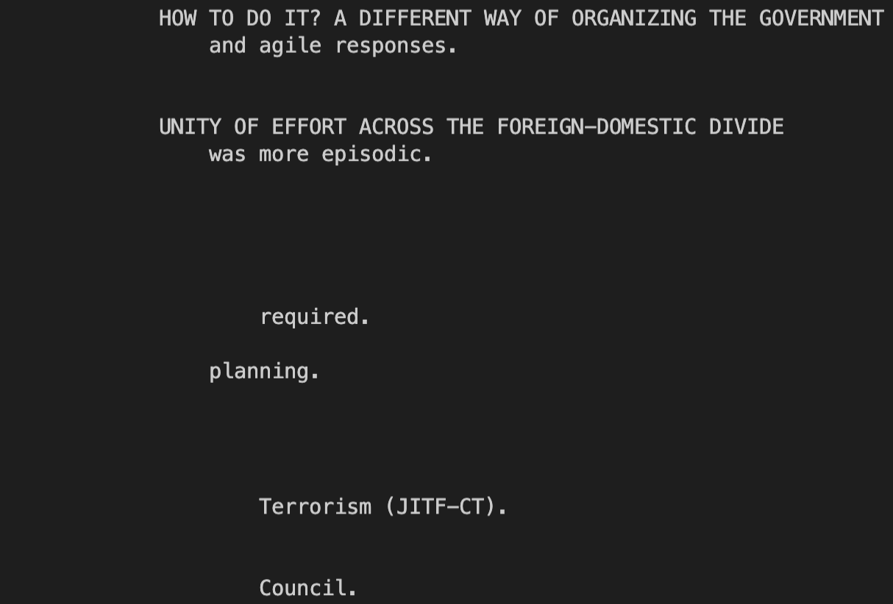

## `grep` Commands

`grep -i`: This command makes the search not case-sensitive. Ignoring case is useful for finding keywords and phrases instead of exact strings.
```
cd technical
cd 911report
grep -i "We Have Some Planes" chapter-1.txt
```


```
cd technical
cd biomed
grep -i "MONOCYTE-DERIVED" 1471-213X-1-11.txt
```


```
cd technical
cd plos
grep -i "AlZhEiMeR" journal.pbio.0020012.txt
```


***

`grep -v`: This command searches for everything except the argument. Inverting the search is useful for excluding specific words, since it is more efficient than searching for everything else manually.
```
cd technical
cd 911report
grep -v "t" chapter-13.1.txt
```


```
cd technical
cd biomed
grep -v "e" 1468-6708-3-10.txt
```


```
cd technical
cd plos
grep -v "a" journal.pbio.0020276.txt
```


***

`grep -n`: This command prints the line number before the matching search. This is useful for knowing where in the file we can find the specified search argument.

```
cd technical
cd 911report
grep -n "THE MILLENNIUM CRISIS" chapter-6.txt
```


```
cd technical
cd biomed
grep -n "neurotoxicity" 1471-2202-2-3.txt
```


```
cd technical
cd plos
grep -n "multi-site" pmed.0020275.txt
```

